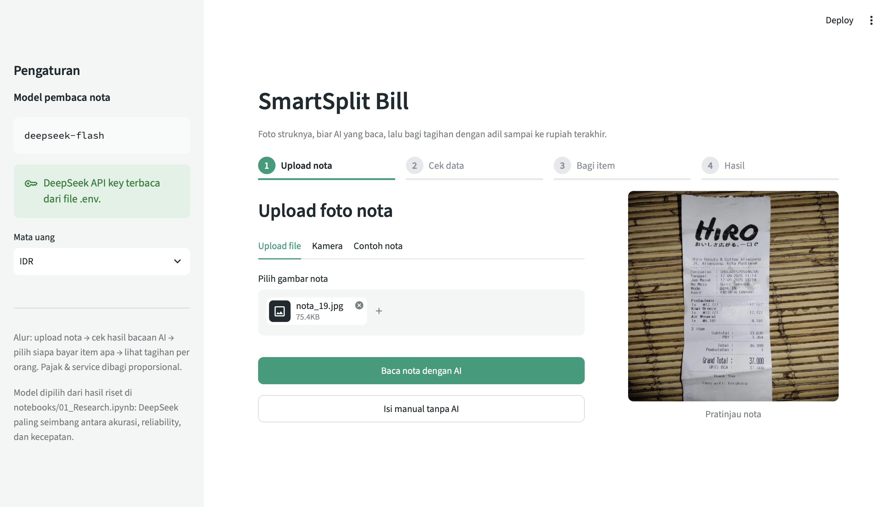
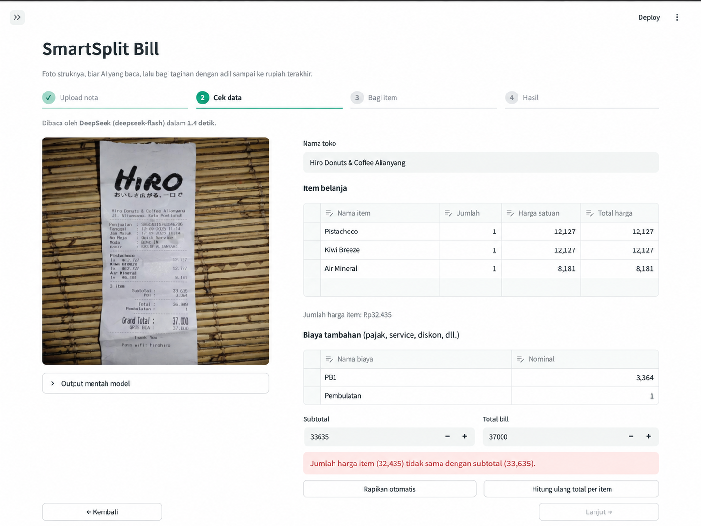
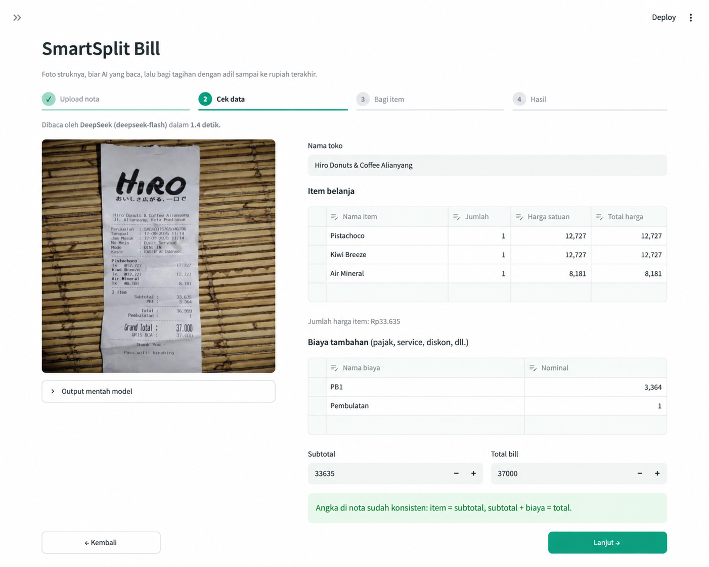
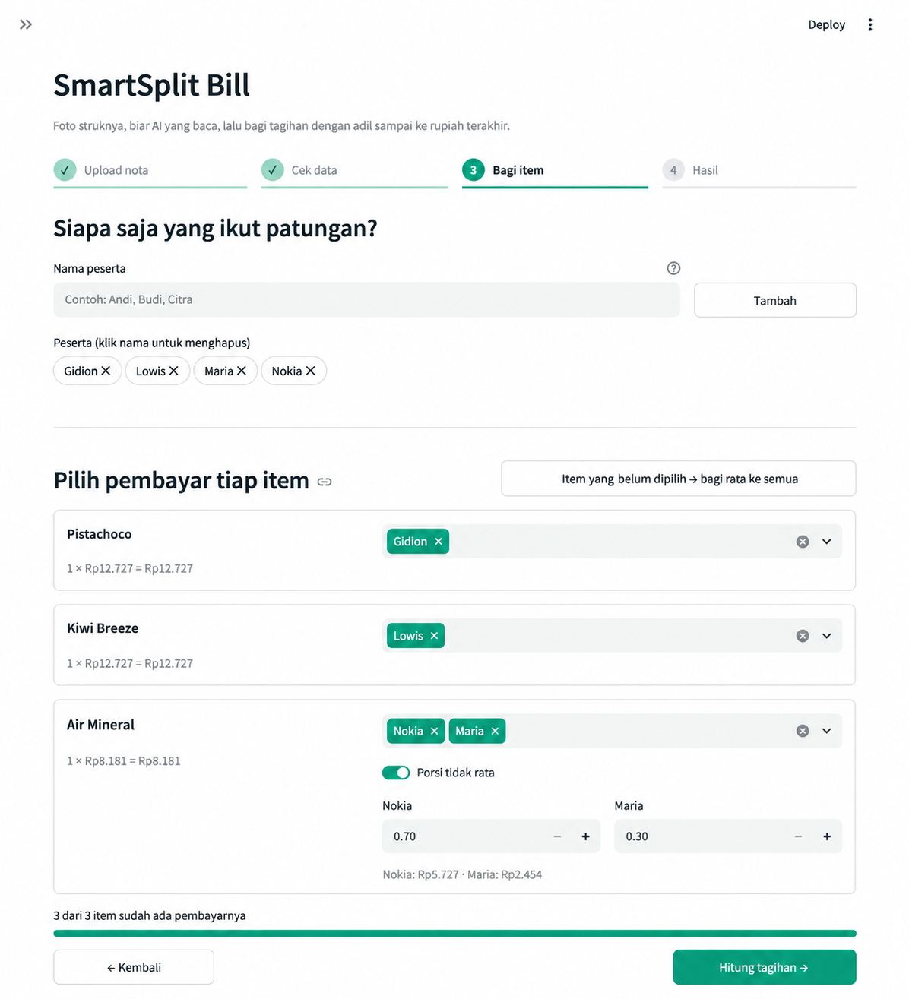
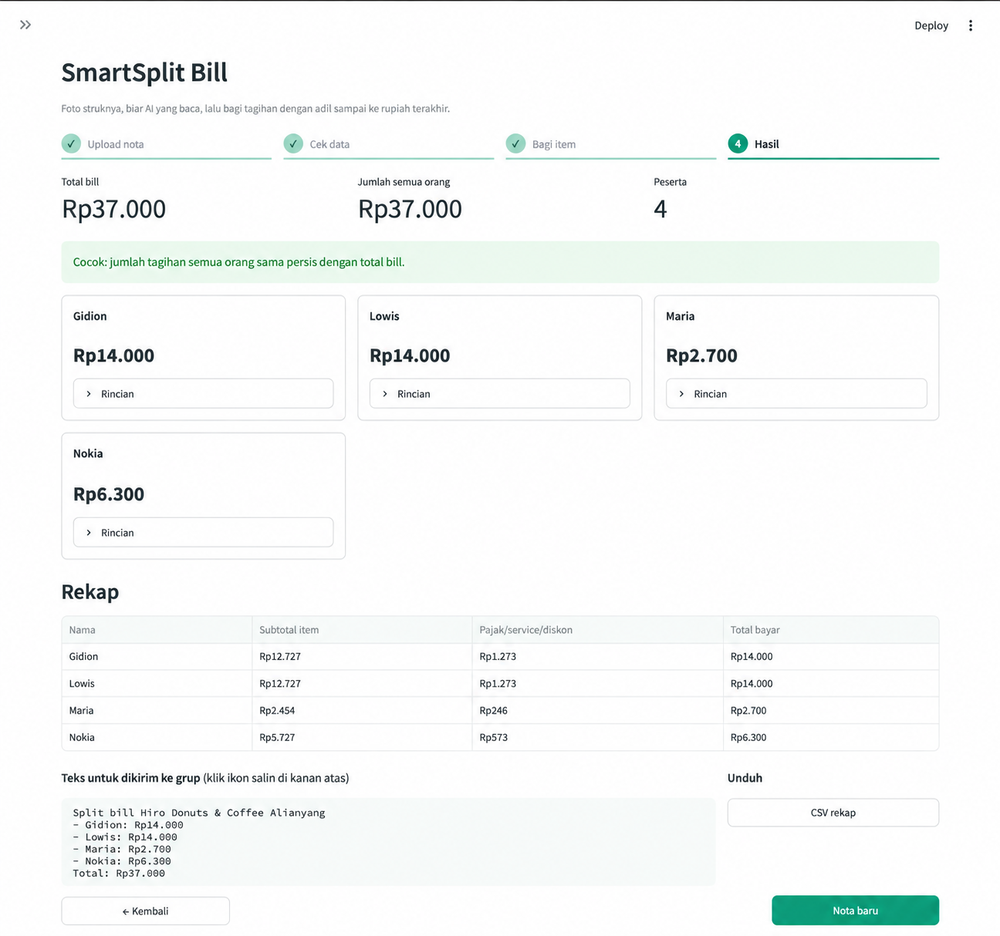
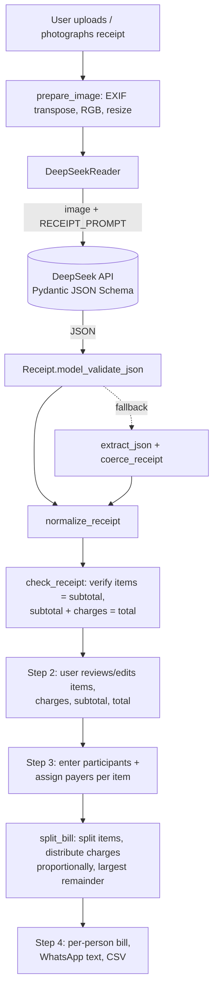
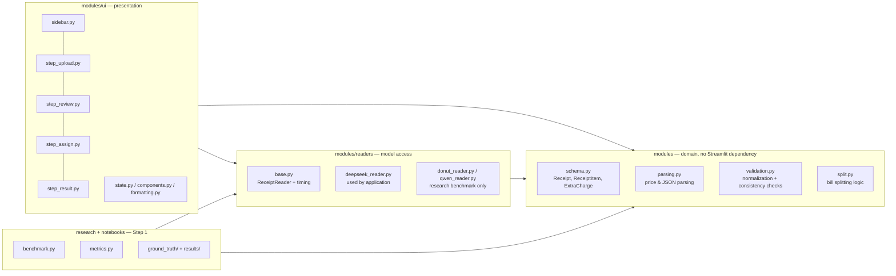
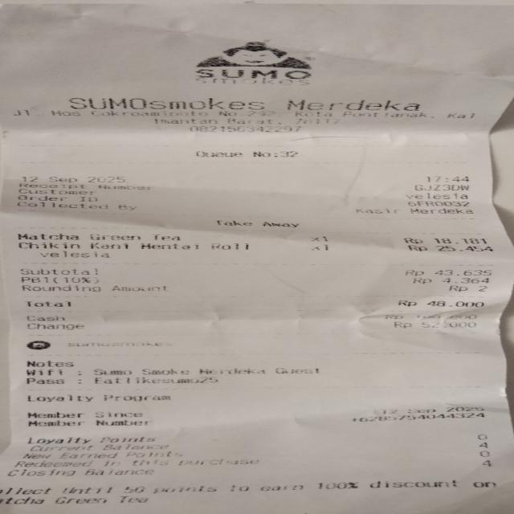
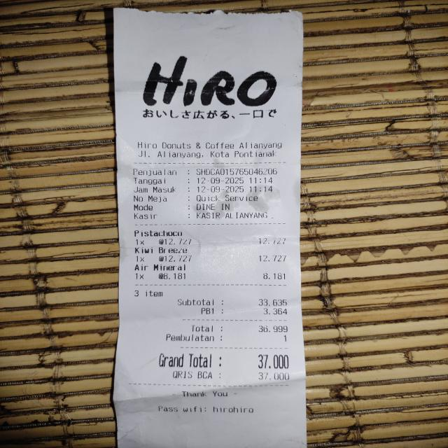

# SmartSplit Bill

<p align="center">
  
  
  
  
  
  
  
  
</p>

A web application for **reading shopping receipts with AI** and **splitting bills** between multiple people while ensuring that the sum of everyone's share exactly matches the final bill.

Built with Python + Streamlit as a **proof-of-concept Smart Split Bill mini project** (Dibimbing DSML).

The production receipt reader uses **DeepSeek** via API, selected after comparing three models in [`notebooks/01_Research.ipynb`](notebooks/01_Research.ipynb).

## Author & Project Links

| | |
|---|---|
| **Author** | `Gidion Depari` |
| **LinkedIn** | [View LinkedIn Profile](www.linkedin.com/in/gidion2)  |
| **Live Demo** | [Open Live Demo](https://smartsplit-bill-ai-elzesdbrvqxzpu5ywhvzka.streamlit.app) |

| | |
|---|---|
| **Stack** | Python 3.11, Streamlit, Pydantic, OpenAI SDK (DeepSeek endpoint) |
| **Application reader** | DeepSeek (`deepseek-flash`) — VLM via API with structured JSON output |
| **Research comparison models** | Donut CORD-v2 (local), Qwen3-VL-2B-Instruct (local) |
| **Research dataset** | 20 real receipt images + manually prepared ground truth |
| **Testing** | 42 unit/integration tests (`pytest`) |

---

## Table of Contents

1. [Features & Requirement Coverage](#1-features--requirement-coverage)
2. [Application Screenshots](#2-application-screenshots)
3. [Architecture](#3-architecture)
4. [Installation & Usage](#4-installation--usage)
5. [Model Reading Examples (2 Receipts)](#5-model-reading-examples-2-receipts)
6. [Step 1: Model Research & Comparison](#6-step-1-model-research--comparison)
7. [Step 2: Prototype & Split-Bill Logic](#7-step-2-prototype--split-bill-logic)
8. [Step 3: Final Evaluation & Analysis](#8-step-3-final-evaluation--analysis)
9. [Project Structure](#9-project-structure)
10. [Reproducing the Research](#10-reproducing-the-research)
11. [Limitations & Notes](#11-limitations--notes)

---

## 1. Features & Requirement Coverage

Application flow: **Upload receipt → Review data → Assign items → Results**.

| Assignment requirement | Implementation |
|---|---|
| A. AI-based receipt reading | `DeepSeekReader` (VLM via API, OCR-free). The research also evaluates local Donut & Qwen-VL models |
| B. Web-based product | Streamlit application (`app.py`) |
| C. Receipt image upload | Upload jpg/jpeg/png/webp, take a photo directly, or select a sample receipt from `samples/` |
| D. Purchase data extraction | Per item: name, quantity, unit price, total price. Also subtotal, extra charges (tax/service/discount/rounding), and total bill — all editable by the user |
| E. Participant input | One input field for multiple names separated by commas; click a name to remove it |
| F. Select payer(s) per item | Each item can be assigned to one or multiple people |
| G. Total per person = final bill | Extra charges are distributed proportionally + **largest remainder** rounding, then verified in the UI |

**Additional features beyond the assignment requirements**

- **Arithmetic validation of AI output.** The app checks whether `sum(item prices) = subtotal` and `subtotal + extra charges = total`. If the numbers do not match, the **Continue** button is locked and the problem is shown to the user. This matters because in the research, **8 of 20 DeepSeek predictions** were not arithmetically consistent.
- **Automatic reconciliation** — one click to align subtotal with the sum of item prices and record the remaining difference as `"Difference / rounding"`.
- **Recalculate item totals** — row total = quantity × unit price.
- **Unequal item shares** for shared items, e.g. 3 satay skewers: 2 portions for Andi and 1 for Budi.
- **Split unassigned items equally** — items not yet assigned can be split between all participants.
- **Per-person breakdown** including assigned items and each person's tax/service share.
- **WhatsApp-ready summary text** and **CSV export**.
- **Manual entry without AI** as a fallback when the API is unavailable or the receipt cannot be read.
- **Raw model output** and **inference time** are visible in the UI for transparency and debugging.
- Participant names are preserved when starting a new receipt because the group is usually the same.

---

## 2. Application Screenshots

The screenshots below use the real receipt `samples/nota_19.jpg` and the DeepSeek output saved from the research benchmark.

**Step 1 — upload a receipt**



**Step 2 — review the extracted data and detect reading errors**

DeepSeek reads two items as `12.127`, while the receipt actually shows `12.727`. As a result, the sum of item prices (Rp32.435) does not match the subtotal (Rp33.635), so the application prevents the user from continuing.



After the numbers are corrected (or automatically reconciled), the receipt becomes consistent and the **Continue** button is enabled.



**Step 3 — assign each item to participants**



**Step 4 — final amount per person**

Mineral water is split equally between three people, PB1 tax and rounding are distributed proportionally, and the final sum of all participants is exactly Rp37.000.



---

## 3. Architecture

### Data Flow



### Code Layers



**Design principles**

- **One schema for every model.** Every reader must return the same `Receipt` object from `modules/schema.py`, so readers can be changed without modifying the UI or split logic. The same Pydantic schema is also sent to DeepSeek as a `json_schema` structured-output definition.
- **Domain logic is separated from the UI.** `parsing`, `validation`, and `split` do not import Streamlit and can be tested with standard pytest tests.
- **Readers are separated from the application.** `ReceiptReader.read()` handles timing, error wrapping, and normalization so the research benchmark evaluates models using the same pipeline as the application.
- **Heavy imports are lazy.** `torch` and `transformers` are loaded only when a local reader is used, so the main application can use the lighter `requirements.txt`.

---

## 4. Installation & Usage

### 4.1 Prerequisites

- Python **3.11+**
- A DeepSeek API key from <https://platform.deepseek.com>

### 4.2 Installation

```bash
git clone <YOUR_REPOSITORY_URL>
cd project-smart-bill-ai

python3 -m venv .venv
source .venv/bin/activate          # Windows: .venv\Scripts\activate

pip install -r requirements.txt    # Streamlit app + DeepSeek reader
```

Optional research dependencies:

```bash
pip install -r requirements-local.txt   # PyTorch/Transformers + local Donut & Qwen models
pip install -r requirements-dev.txt     # pytest + Jupyter + matplotlib
```

### 4.3 Configure the API Key

```bash
cp .env.example .env
```

Fill in `.env`:

```dotenv
DEEPSEEK_API_KEY=sk-xxxxxxxxxxxxxxxx
DEEPSEEK_MODEL=deepseek-flash
```

The API key and model name can also be entered/overridden from the application sidebar. `.env` is included in `.gitignore`, so the key is not committed to Git.

### 4.4 Run the Application

```bash
streamlit run app.py
```

Open <http://localhost:8501>. If you do not have a receipt image, use the **Sample Receipt** tab in step 1 to choose an image from `samples/`.

### 4.5 Run with Docker

```bash
docker build -t smartsplit .
docker run -p 8501:8501 --env-file .env smartsplit
```

To include the much larger local-model dependencies:

```bash
docker build --build-arg WITH_LOCAL_MODELS=1 -t smartsplit-local .
```

### 4.6 Run Tests

```bash
pytest
```

Current test suite: **42 unit/integration tests** covering parsing, validation, bill splitting, metrics, model readers, and application flow.

---

## 5. Model Reading Examples (2 Receipts)

The examples below are real DeepSeek outputs from the benchmark and are stored under `research/results/predictions/deepseek/`.

### Example 1 — `samples/nota_17.jpg`

SUMOsmokes Merdeka receipt with PB1 + rounding.



Raw model output:

```json
{
  "merchant_name": "SUMOSmokes Merdeka",
  "items": [
    {
      "name": "Matcha Green Tea",
      "quantity": 1,
      "unit_price": 18181,
      "total_price": 18181
    },
    {
      "name": "Chikin Kari Mentai Roll",
      "quantity": 1,
      "unit_price": 25454,
      "total_price": 25454
    }
  ],
  "subtotal": 43635,
  "charges": [
    {
      "name": "PB1 (10%)",
      "amount": 4364
    },
    {
      "name": "Rounding Amount",
      "amount": 2
    }
  ],
  "total": 48000
}
```

| Field | Ground truth | DeepSeek | Status |
|---|---|---|---|
| Item 1 | Matcha Green Tea — 1 × 18.181 | Matcha Green Tea — 1 × 18.181 | ✅ |
| Item 2 | Chicken Katsu Mentai Roll — 1 × 25.454 | **Chikin Kari Mentai Roll** — 1 × 25.454 | ⚠️ name incorrect, numbers correct |
| Subtotal | 43.635 | 43.635 | ✅ |
| PB1 (10%) | 4.364 | 4.364 | ✅ |
| Rounding | 2 | 2 | ✅ |
| Total | 48.000 | 48.000 | ✅ |

Metrics: `item_f1 = 1.00`, `total_price_acc = 1.00`, `name_cer = 0.10`, `total_ok = True`, `consistent = True`.

All numerical values are correct. Only the item name is misread, which has little impact on bill splitting and can easily be corrected by the user in step 2.

### Example 2 — `samples/nota_19.jpg`

Hiro Donuts & Coffee receipt with PB1 + rounding.



Raw model output:

```json
{
  "merchant_name": "Hiro Donuts & Coffee Alianyang",
  "items": [
    {
      "name": "Pistachoco",
      "quantity": 1,
      "unit_price": 12127,
      "total_price": 12127
    },
    {
      "name": "Kiwi Breeze",
      "quantity": 1,
      "unit_price": 12127,
      "total_price": 12127
    },
    {
      "name": "Air Mineral",
      "quantity": 1,
      "unit_price": 8181,
      "total_price": 8181
    }
  ],
  "subtotal": 33635,
  "charges": [
    {
      "name": "PB1",
      "amount": 3364
    },
    {
      "name": "Pembulatan",
      "amount": 1
    }
  ],
  "total": 37000
}
```

| Field | Ground truth | DeepSeek | Status |
|---|---|---|---|
| Item 1 | Pistachio — 1 × 12.727 | Pistachoco — 1 × **12.127** | ❌ one price digit is wrong |
| Item 2 | Kiwi Breeze — 1 × 12.727 | Kiwi Breeze — 1 × **12.127** | ❌ one price digit is wrong |
| Item 3 | Air Mineral — 1 × 8.181 | Air Mineral — 1 × 8.181 | ✅ |
| Subtotal | 33.635 | 33.635 | ✅ |
| PB1 | 3.364 | 3.364 | ✅ |
| Rounding | 1 | 1 | ✅ |
| Total | 37.000 | 37.000 | ✅ |

Metrics: `item_f1 = 1.00`, `total_price_acc = 0.33`, `subtotal_ok = True`, `total_ok = True`, `consistent = False`.

This receipt is used in the application screenshots because it demonstrates the value of arithmetic validation. The subtotal and total are correct, but two item prices are each misread by one digit:

`12.127 + 12.127 + 8.181 = 32.435 ≠ 33.635`

The application detects the mismatch and prevents the user from splitting an incorrect bill.

---

## 6. Step 1: Model Research & Comparison

Full notebook with outputs: [`notebooks/01_Research.ipynb`](notebooks/01_Research.ipynb).

### 6.1 Experimental Setup

| | |
|---|---|
| Dataset | 20 real receipt images from minimarkets, cafés, restaurants, and a cosmetics store; ground truth manually written to `research/ground_truth/*.json` |
| Hardware | MacBook Pro M2 Max, 32 GB RAM, macOS 26.5.2, PyTorch 2.9.0 with MPS enabled |
| Number of runs | Local models: 3 runs/receipt (60 inference runs); DeepSeek: 1 run/receipt (20 inference runs) to reduce API usage |
| Candidates | DeepSeek `deepseek-flash` (API), Donut `naver-clova-ix/donut-base-finetuned-cord-v2` (local), Qwen `Qwen/Qwen3-VL-2B-Instruct` (local) |
| Note | All three are **OCR-free**. DeepSeek & Qwen use the same prompt (`modules/readers/prompt.py`); Donut does not use the prompt because it was fine-tuned on CORD |

### 6.2 Evaluation Metrics

| Metric | Meaning |
|---|---|
| `item_f1` | F1 score for predicted items matched against ground truth using name similarity |
| `name_cer` | Character Error Rate for item names; **lower is better** |
| `qty_acc` / `unit_price_acc` / `total_price_acc` | Proportion of ground-truth items whose quantity / unit price / total price is exactly correct |
| `item_exact_rate` | Proportion of items whose name, quantity, and price are all correct |
| `subtotal_ok` / `total_ok` | Proportion of receipts with correct subtotal / total |
| `charges_recall` | Proportion of extra charges such as tax, service, and discount that were found |
| `consistent` | Proportion of predictions that pass the application's arithmetic consistency checks |
| `run_success_rate` | Proportion of inference runs that produce JSON that can be processed |
| `mean_s` | Mean inference time per receipt |

### 6.3 Results (20 Receipts)

| Metric | **DeepSeek** (API) | Donut CORD-v2 (local) | Qwen3-VL-2B (local) |
|---|---:|---:|---:|
| Item F1 | **0.839** | 0.459 | 0.821 |
| Name CER ↓ | **0.162** | 0.468 | 0.170 |
| Quantity accuracy | **0.899** | 0.553 | 0.826 |
| Unit price accuracy | **0.759** | 0.212 | 0.688 |
| Total price accuracy | **0.759** | 0.382 | 0.688 |
| Item exact rate | **0.603** | 0.218 | 0.587 |
| Subtotal OK | **0.750** | 0.600 | 0.500 |
| Charges recall | **0.850** | 0.575 | 0.550 |
| Total OK | **0.850** | 0.350 | 0.300 |
| Consistent | **0.600** | 0.000 | **0.600** |
| Run success rate | **100%** (20/20) | **100%** (60/60) | 95% (57/60) |
| Receipt parse rate | **100%** | **100%** | **100%** |
| Model load time | 0 s (API) | 6.6 s | 10.8 s |
| Mean inference time | **1.67 s** | 2.15 s | 10.70 s |
| Inference range | 0.89–4.20 s | 0.21–8.86 s | 5.15–34.05 s |

Per-receipt view:

| | DeepSeek | Donut | Qwen3-VL-2B |
|---|---:|---:|---:|
| All items detected correctly (`item_f1 = 1`) | **13** | 0 | **13** |
| All item prices correct | **14** | 6 | 9 |
| Correct subtotal | **15** | 12 | 10 |
| Correct total bill | **17** | 7 | 6 |
| Arithmetically consistent output | **12** | 0 | **12** |

Source files: `research/results/summary.csv`, `research/results/accuracy.csv`, `research/results/runs.csv`.

### 6.4 Why DeepSeek Was Selected

**DeepSeek is used as the application reader** because it performed best across all three key evaluation groups:

1. **Highest accuracy.** Item F1 = 0.839, lowest name CER = 0.162, and most importantly for bill splitting, the **total bill was correct on 17 of 20 receipts**. Qwen achieved 6/20 and Donut 7/20.
2. **Full structured-output reliability in this benchmark.** All 20/20 DeepSeek inference runs produced JSON that validated against the `Receipt` schema. Qwen, which relies on prompt-guided output, failed on 3 of 60 runs.
3. **Fastest and lightest on the client side.** Mean inference = 1.67 s/receipt without downloading model weights or requiring a large local GPU/RAM footprint.

**Why not Qwen3-VL-2B as the main reader?** Its item-level accuracy is close to DeepSeek (F1 0.821), and it has clear advantages: local execution, no API cost, offline use, and receipt data stays on the user's computer. However, the total bill was correct on only 6 of 20 receipts, inference was approximately **6× slower** on this setup, and structured output was not fully stable. In the `nota_14` experiment, the model entered **degenerate repetition** until it reached the 1024-token limit, leaving the JSON unfinished. After changing generation to sampling (`do_sample=True`, `temperature=0.7`), the receipt could succeed, but output became nondeterministic across runs.

**Why not Donut CORD-v2 as the main reader?** Parsing was highly stable and inference was relatively fast, but extraction accuracy was the lowest: item F1 = 0.459, unit-price accuracy = 0.212, total accuracy = 0.350, and **none** of its receipt predictions passed the application's arithmetic consistency check. This is understandable because Donut was fine-tuned on the CORD dataset, whose receipt distribution differs from the Indonesian receipts in this dataset.

Both local readers are kept in the repository (`modules/readers/donut_reader.py`, `modules/readers/qwen_reader.py`) so the research can be reproduced, while the application itself uses DeepSeek.

---

## 7. Step 2: Prototype & Split-Bill Logic

### 7.1 Four UI Steps

| Step | File | Purpose |
|---|---|---|
| 1. Upload receipt | `modules/ui/step_upload.py` | Upload file / camera / sample receipt, preview image, run reader, or use manual input |
| 2. Review data | `modules/ui/step_review.py` | Editable item & charge tables, subtotal & total, arithmetic validation, quick fixes, raw model output |
| 3. Assign items | `modules/ui/step_assign.py` | Add participants, select payers, use unequal shares, track assignment progress |
| 4. Results | `modules/ui/step_result.py` | Per-person total + breakdown, summary table, WhatsApp text, CSV download |

### 7.2 How the Bill Is Split (`modules/split.py`)

1. **Item prices** are split between selected participants according to their assigned shares.
2. **Extra charges** such as tax, service, discounts, and rounding are distributed **proportionally to each person's item subtotal**.
3. **Largest remainder rounding** floors individual values first, then allocates remaining rupiah to the largest fractional remainders so the final sum **always equals the bill total**.

Example: Rp100.000 divided equally between three people produces Rp33.333,33 each. Normal rounding can result in Rp99.999. Largest remainder produces:

`Rp33.334 + Rp33.333 + Rp33.333 = Rp100.000`

In the step-4 screenshot:

`Dion Rp16.945 + Rani Rp16.944 + Bagas Rp3.111 = Rp37.000`

### 7.3 Handling Imperfect AI Output

| Layer | Function |
|---|---|
| `Receipt.model_validate_json` | Validates typed structured output from DeepSeek |
| `extract_json` + `coerce_receipt` | Fallback parsing for JSON and Indonesian-style price formats |
| `normalize_receipt` | Fills missing unit price/subtotal/total and forces discounts to negative values |
| `check_receipt` | Checks arithmetic consistency; errors block Continue while warnings inform the user |
| `reconcile_receipt` | Quick-fix logic used by **Automatic reconciliation** |
| Editable table in step 2 | The user remains the final authority |

### 7.4 Testing

The project currently includes **42 tests** executed with `pytest`:

- `test_parsing.py` — Indonesian price formats, quantities such as `"2x"` / `"x3"`, JSON extraction from model output.
- `test_validation.py` — normalization, subtotal/total mismatch detection, reconciliation, negative discounts.
- `test_split.py` — sum of all participant totals equals final bill, proportional charges, unequal shares, participants without items, unassigned items.
- `test_metrics.py` — CER, F1, failed predictions.
- `test_donut_mapping.py` — CORD output mapping to the shared `Receipt` schema.
- `test_deepseek_reader.py` — missing API key errors, model name resolution, image data-URL encoding, JSON schema.
- `test_app_flow.py` — full app flow using `streamlit.testing.AppTest` and a fake reader without calling the API.

---

## 8. Step 3: Final Evaluation & Analysis

### 8.1 AI Model Evaluation — DeepSeek

What already works well: 100% structured-output reliability in the benchmark, correct total bill on 17/20 receipts, strong extra-charge detection (`charges_recall = 0.85`), and mean inference time of 1.67 s/receipt.

**Weaknesses found in the dataset**

1. **Hallucinated charges that are not actually additional costs.** On `nota_01` and `nota_02` (Alfamart receipts), the model adds a `"PPN"` charge and increases the final total. Retail receipts can include PPN/DPP informational lines that are not separate charges.
2. **Digit misreading in prices.** In `nota_19`, `12.727` is read as `12.127` for two items. Subtotal and total are still read correctly, so only arithmetic validation reveals the mismatch.
3. **Supplementary lines incorrectly interpreted as items.** In `nota_08`, one ground-truth item becomes six predicted items because menu-option lines with zero prices are treated as separate items. In `nota_12`, a unit-price line such as `1x @18,000` becomes its own item.
4. **Long, dense receipts are the hardest.** `nota_06`, containing 22 items on a small and slightly blurry minimarket receipt, has low item-level accuracy even though the final total is still correct.
5. **Minor item/merchant name typos.** Name CER = 0.162. These usually have limited impact on bill splitting but reduce user trust.
6. **Cloud dependency.** The application needs internet access and an API key, has API usage costs/limits, and uploads receipt images to a third-party service.
7. **Local alternatives are not yet ready as the primary reader.** Qwen failed to produce valid JSON on some runs, while Donut never produced an arithmetically consistent receipt in this dataset.

**Model improvement ideas**

1. Strengthen the prompt with explicit rules such as: do not create tax lines unless they are real added charges; ignore zero-priced menu options; ignore unit-price helper lines such as `1x @18.000`.
2. Add few-shot examples from Indonesian receipts.
3. Add an automatic correction loop when `check_receipt` fails.
4. Use self-consistency for difficult receipts: read 2–3 times and choose a result that passes arithmetic validation.
5. Suggest one-digit price corrections that would make item totals match the subtotal.
6. Add receipt preprocessing such as edge detection, crop, deskew, and contrast enhancement.
7. Use a two-pass extraction: items first, totals/charges second.
8. Add a model router: DeepSeek as primary reader with Qwen as an offline/local fallback.
9. Improve local-model decoding and optimization to reduce repetition and latency.
10. Fine-tune a local reader using corrected receipt data collected from the review step.
11. Expand and stratify the evaluation dataset.

### 8.2 Product Evaluation — Web Application

What already works well: the four-step flow is easy to follow, AI output can be fully corrected, arithmetic validation prevents splitting incorrect data, final participant totals are guaranteed to match the bill total, and the result can be copied or exported.

**Product limitations**

1. **No persistence.** State currently lives in `st.session_state`, so a browser refresh or closed tab removes the session.
2. **One receipt per session.** Multiple receipts from the same event cannot yet be combined.
3. **One person controls all input.** Participants cannot select their own items through a shared link.
4. **Extra charges are only proportional.** Some charges such as parking or delivery may be fairer when split equally.
5. **Mobile experience can be improved.** Editable tables require horizontal scrolling.
6. **Automatic reconciliation can hide reading errors** if a large difference is simply turned into a `"Difference / rounding"` charge.
7. **No authentication or usage limits.** A public deployment could expose the server-side API quota.
8. **No structured observability.** Inference time is shown in the UI, but there is no logging/alert system.
9. **No poor-photo detection.** The application assumes the receipt is reasonably clean and focused.
10. **Language and currency support are limited.**

**Product improvement ideas**

1. Persist sessions and receipt history using SQLite or Supabase.
2. Add shareable collaborative sessions where participants choose their own items.
3. Support proportional / equal / selected-participant charge distribution.
4. Build a mobile-first card interface and optionally a PWA.
5. Highlight suspicious item rows directly.
6. Warn before automatic reconciliation when the difference exceeds a threshold.
7. Cache results using image hashes and add API retries with backoff.
8. Add authentication, rate limits, and structured logs.
9. Add blur/dark-image detection before sending an image to the model.
10. Add settlement support such as payment links/QRIS and paid/unpaid status.
11. Improve accessibility and internationalization.

### 8.3 Conclusion

This prototype shows that receipt reading with a VLM is already useful enough for an assisted workflow. DeepSeek reads the final bill correctly on 17 of 20 receipts and consistently produces processable structured output in this benchmark.

However, the model is **not reliable enough to be trusted without user verification**. The receipts that fail arithmetic consistency are the main reason the application includes validation and an editable review step from the beginning rather than treating them as optional features.

The biggest lesson from the research is that **accuracy alone is not enough** for this product. A model must also reliably produce processable structured output, remain stable across repeated reads, and respond fast enough for interactive use. That combination is why DeepSeek was selected rather than choosing a model based on a single metric.

---

## 9. Project Structure

```text
project-smart-bill-ai/
├── app.py                          # Streamlit entry point
├── modules/
│   ├── schema.py                   # Receipt, ReceiptItem, ExtraCharge
│   ├── parsing.py                  # Indonesian price parsing + JSON extraction
│   ├── validation.py               # normalization, consistency checks, reconciliation
│   ├── split.py                    # split-bill logic + largest remainder
│   ├── readers/
│   │   ├── base.py                 # ReceiptReader, timing, errors, normalization
│   │   ├── prompt.py               # RECEIPT_PROMPT used by DeepSeek & Qwen
│   │   ├── deepseek_reader.py      # application reader
│   │   ├── donut_reader.py         # local research reader
│   │   ├── qwen_reader.py          # local research reader
│   │   ├── device.py               # cuda/mps/cpu selection
│   │   └── registry.py             # reader registry / factory
│   └── ui/
│       ├── sidebar.py
│       ├── step_upload.py
│       ├── step_review.py
│       ├── step_assign.py
│       ├── step_result.py
│       ├── state.py
│       ├── components.py
│       └── formatting.py
├── research/
│   ├── ground_truth/               # 20 manual JSON labels
│   ├── metrics.py                  # evaluation metrics
│   ├── benchmark.py                # accuracy + speed + reliability benchmark
│   └── results/                    # CSV/JSON results + predictions
├── notebooks/
│   └── 01_Research.ipynb           # research & model-selection notebook
├── samples/                        # 20 receipt images
├── docs/
│   └── screenshots/
├── tests/                          # 42 tests
├── requirements.txt                # application dependencies
├── requirements-local.txt          # local-model research dependencies
├── requirements-dev.txt            # notebook & testing dependencies
├── Dockerfile
└── .env.example
```

---

## 10. Reproducing the Research

Install development/research dependencies:

```bash
pip install -r requirements-dev.txt
```

Benchmark all models:

```bash
python -m research.benchmark --runs 3
```

> DeepSeek requires an API key. Donut and Qwen download model weights from Hugging Face.

Benchmark only DeepSeek with one run per receipt:

```bash
python -m research.benchmark --models deepseek --runs 1
```

Or run the research notebook:

```bash
jupyter notebook notebooks/01_Research.ipynb
```

Results are written to `research/results/`:

- `summary.csv` — model-level summary
- `accuracy.csv` — per-receipt accuracy
- `runs.csv` — per-inference timing and reliability
- `environment.json` — benchmark environment
- `predictions/<model>/<receipt>.json` — raw output, parsed prediction, and metrics

To add another test receipt, save the image as `samples/nota_21.jpg` and create the corresponding ground truth file at `research/ground_truth/nota_21.json`. The benchmark pairs them by filename stem.

---

## 11. Limitations & Notes

- The **20-receipt dataset** is sufficient for comparing the behavior of the three approaches in this mini project, but it does not represent every receipt type. The reported accuracy values apply to this dataset only.
- **Run counts are different:** DeepSeek uses 1 run/receipt to reduce API usage, while local models use 3 runs/receipt. DeepSeek reliability is therefore based on 20 inference runs, while local-model reliability is based on 60.
- **Latency is not completely apples-to-apples:** DeepSeek computation occurs on a cloud server, while Donut and Qwen run locally on the MacBook. DeepSeek timing includes network latency.
- `memory_mb_after_load` is **not used as a decision metric** because PyTorch/MPS RSS deltas can become negative due to allocator behavior and memory release.
- Accuracy is calculated from the **first successful run**, so it must be interpreted together with `run_success_rate`.
- **Ground truth remains the reference** and is never changed to match a model prediction.
- Historical note: the early experiment used Gemini as the API reader, but repeated quota limitations led to replacing it with DeepSeek and removing Gemini code from the final project.
- The application assumes receipt images are **reasonably clean and focused**, as defined by the assignment requirements.

---

## Dependencies

### Application

```text
streamlit==1.64.0
openai>=3.14,<4
pydantic==2.13.5
pandas==2.3.3
pillow==12.3.0
python-dotenv==1.2.3
psutil==7.2.2
```

### Local Research Models

```text
-r requirements.txt

torch==2.9.0
torchvision==0.24.0
transformers==4.57.1
sentencepiece==0.2.1
protobuf==7.36.1
```

### Notebook & Testing

```text
-r requirements-local.txt

pytest==9.1.1
jupyter
matplotlib==3.11.2
```

---

## Author

| **Author** | `Gidion Depari` |
| **LinkedIn** | [View LinkedIn Profile](www.linkedin.com/in/gidion2)  |
| **Live Demo** | [Open Live Demo](https://smartsplit-bill-ai-elzesdbrvqxzpu5ywhvzka.streamlit.app) |

If you use this project as a portfolio piece, replace the placeholders above before publishing the repository.
